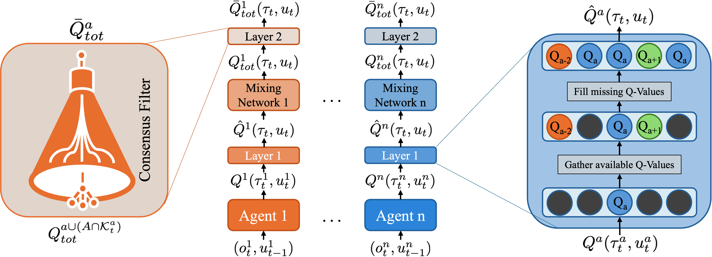

# Dec-QMIX

This is the codification used in the IROS 2025 paper, which examines the challenges of implementing Centralized Training and Decentralized Execution (CTDE) in a network of Unmanned Aerial Vehicles (UAVs) for monitoring dynamic wildfire fronts. 

The most prominent CTDE framework, QMIX has shown exceptional performance in cooperative multi-agent environments like the StarCraft 2 Multi-Agent Challenge (SMAC2). However, implementing CTDE in real-world multi-robot applications has significant limitations. The unpredictable and dynamic nature of scenarios such as wildfires makes training under CTDE frameworks impractical, due to difficulties in gathering sufficient high-fidelity data points and modeling such volatile environments for effective training. Moreover, the training must continue throughout the operation to learn and adapt to sparse and unpredictable events as they occur. 

To address these issues, we propose Decentralized QMIX (Dec-QMIX), a novel approach that bridges the gap between QMIX and Independent Q-Learning (IQL). Dec-QMIX learns a decentralized, factored joint action-value function, enabling adaptive coordination among UAVs. It employs a local per-agent mixing network for joint action-value estimation and a distributed consensus filter to achieve convergence to a unified joint action-value function in a decentralized manner.

